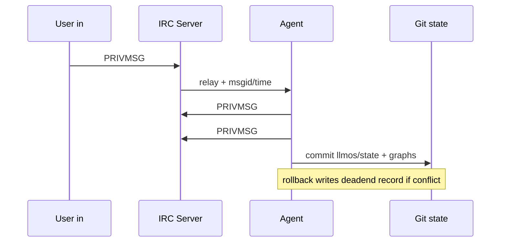
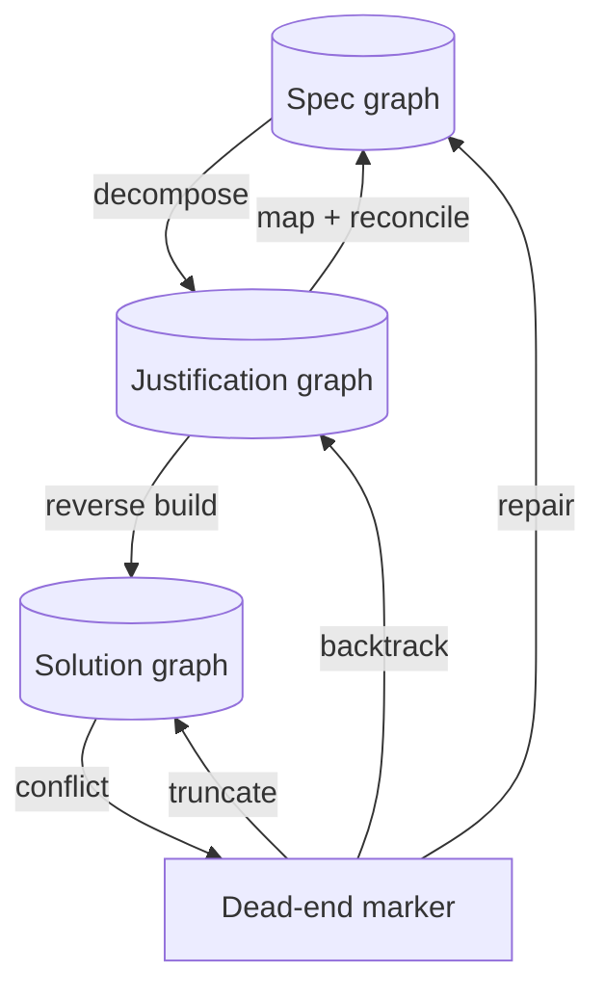

# LLMOS-Chat: IRC-Native Collaborative AI with ii-Style Persistence and Toribrot State

## Executive summary

The entity["organization","LLMOS-Chat","github repo fork of ergo"] repository is, in its current `master` branch as accessible via the enabled connector, structurally and semantically an entity["organization","Ergo","go irc server project"] (formerly entity["organization","Oragono","former name of ergo ircd"]) fork: the top-level `README.md` describes Ergo/Oragono’s goals (modern IRC server in Go, integrated bouncer/history/services, YAML config), and the Go module path is `github.com/ergochat/ergo` (indicating close tracking of upstream). citeturn7search0turn7search4

Your requested “server-directed historical replay” and “rewind audit chunk by chunk” can be implemented largely with existing entity["organization","IRCv3","irc protocol extensions working group"] primitives (`batch`, `server-time`, `message-tags`, `message-ids`, `draft/chathistory`, optionally `draft/event-playback`) rather than inventing a brand-new wire format. In particular, `CHATHISTORY` + `BATCH` already supports “infinite scroll” and deterministic message ordering keyed by `msgid`/timestamps, which is the protocol-level equivalent of “insert older chunks into the window.” citeturn9search0turn16search0turn15search0turn14search0turn14search1

An ii-style persistence layer is best approached as a *file-backed event sink* (append-only per-buffer logs, ii-like directory tree) plus an optional *file-to-IRC gateway* (local FIFOs or a small helper daemon) rather than trying to force the server itself to behave literally like the ii client. The essential ii idea is the filesystem tree (`…/<server>/<channel>/in|out`) and a scripting-friendly append-only `out`. citeturn8search0turn8search1

On “internal channels” for deliberations vs “public channels,” there are two pragmatic options: (a) **no protocol change** and use namespace conventions on `#` channels (e.g., `#proj`, `#proj.delib`, `#proj.state`) coupled with secret/invite-only modes; or (b) **extend channel types** to allow `&` for internal/audit buffers. The current codebase hard-codes channel types to `#` and casefolding logic rejects `&` channel names, so option (b) requires concrete code changes in both the channel-type constant and channel-name validation. citeturn16search0turn14search1

Provider integration for “log in to OpenAI / xAI / Ollama agents” is most robust if you treat providers as *pluggable backends* behind a single “chat completion” interface. entity["company","Ollama","local llm runtime"] explicitly supports an OpenAI-compatible `/v1/chat/completions` endpoint (API key required-but-ignored), while entity["company","xAI","ai model api provider"] provides “Chat Completions” as a legacy endpoint with `XAI_API_KEY`. citeturn11search0turn11search2turn11search1 For entity["company","OpenAI","ai research and products company"], use the official OpenAI API endpoints and follow key-safety guidance (don’t commit keys, prefer project-based keys for collaboration). citeturn12search4turn12search0turn12search2

Finally, on GitHub write/commit automation: OpenAI’s built-in connectors are described as search-only and not supporting write actions; deep research custom connectors are also constrained to read/fetch in the referenced OpenAI help material. That matches what we can observe here (read-focused GitHub tool surface), so plan for commits via a *real CI runner / local git* rather than expecting the connector to push code. citeturn10search1turn10search0

## Repository inspection with emphasis on server, history, and channel typing

### High-level structure baseline

Upstream Ergo’s repo structure (which this fork closely follows) centers on:

- `irc/` (core server implementation in Go)
- `docs/`, `distrib/`, and `default.yaml` (operator configuration)
- `languages/`, `vendor/`, plus build tooling and `ergo.go` entrypoint citeturn7search4turn7search0

The fork’s `default.yaml` includes a full `history:` section describing in-memory history buffers, autoreplay, and optional persistent MySQL history—aligning with Ergo’s role as “ircd + bouncer + services.” citeturn7search0turn9search0

### Channel type limitation that matters for “&/% internal channels”

In the fork’s server core, channel types are currently restricted to `#` (the code comment indicates any change must also be reflected in channel casefolding). This is consistent with the channel-name validation logic that only accepts names beginning with one or more `#` characters and rejects any other leading prefix. This is a key constraint for your “use &/% prefix channels” plan: `&` is not presently accepted as a channel prefix, and `%` is *not* a standard channel type (it’s commonly used as a *membership prefix* for half-op in some IRCds), so `%` as a channel-type is likely to cause client compatibility issues even if you add it. citeturn14search1turn8search1

### Existing “AI/agent code” in-tree

With current connector limitations (no reliable code-search hits for arbitrary strings) and the observed server code being straight Ergo-style, any dedicated AI agent implementation appears either not present in `master` yet or not discoverable via connector search at the moment. Treat “AI agent” as a *new subsystem* you will add (likely as an external bot/service first, then optionally as a server plugin or integrated component later).

### The “chat/ (ii client)” observation

Your request emphasizes a `chat/` subdirectory containing the ii client. When directly probing common paths (e.g., `chat/README*`, `chat/ii.c`, `chat/ii/ii.c`) via the connector’s file fetch, those paths returned “Not Found,” suggesting one of: it is not committed on `master`, it lives under a different path name, or the current branch differs from your expectation.

Because ii’s core idea is the filesystem interface (directory tree with `in` FIFO and `out` log), you can proceed with the design and implementation plan even if ii is not vendored in-tree yet; you can vendor it later or implement a compatible layout. citeturn8search0turn8search1turn8search3

## Toribrot artifact persistence model and compact formats

### What needs to be persisted

You described a two-pass, counter-directional multi-agent system:

- Pass A: **Specification graph** → decomposed semantic landscape → unified scaffold.
- Pass B: **Solution graph** built “in the opposite direction,” connecting solution leaves to justifications, producing a coherent response/program.
- On conflict: mark a **dead-end justification**, truncate downstream solution, backtrack, and repair justification/spec. (This is effectively a DAG with pruning + backtracking.)

To make that recoverable across restarts and across multiple agents, persist four categories:

1. **Pants/Toribrot graphs** (spec/justification/solution as separate but linked graphs)
2. **Deliberation logs** (high-volume, optional replay)
3. **State snapshots** (low-volume, authoritative “resume here”)
4. **Dead-end records** (explicit conflict markers and rollback anchors)

### Where to store artifacts in the repo

A practical repository layout that keeps “machine state” separate from “source code,” while still being greppable and diff-friendly:

- `llmos/state/` — authoritative snapshots (small, stable)
- `llmos/graphs/` — Toribrot pants graphs (append-only or versioned)
- `llmos/logs/` — deliberation/event logs (can be large; consider `.gitignore` or periodic squashing)
- `llmos/deadends/` — dead-end markers, conflict analyses, rollback pointers
- `llmos/schema/` — JSON Schema (or simple versioned docs) for validation

If you want Git history to *be* the provenance, keep snapshots small and commit frequently; keep raw logs either out of Git or rolled up (e.g., weekly squashed snapshots). This aligns with the general principle that event streams can be huge, but state checkpoints should be compact.

### Machine-readable format choice: JSON Lines for events, YAML for snapshots

A good compromise:

- **Events:** JSON Lines (`.jsonl`) for append-only logs (one event per line; streaming-friendly).
- **Snapshots:** YAML (`.yaml`) for human review (structured, diffable).
- **Graphs:** either YAML (small) or JSON (if you want strict schema tooling).

This also maps cleanly onto IRCv3 metadata constraints if you later choose to mirror pointers into IRC message tags (tags need to be short and ASCII keys/values, and have a strict size budget). citeturn14search1

### Proposed compact Toribrot graph schema

Key design choices reflecting your “pants decomposition” semantics:

- Every node has **exactly three interfaces**: `{leg_a, leg_b, waist}`.
- A child attaches its `waist` to a parent’s `leg_*`.
- Nodes are typed: `spec`, `justification`, `solution`.
- Edges are typed: `decomposes_to`, `justifies`, `solves`, `attaches`.

#### Example YAML: snapshot with graph pointers

```yaml
version: 1
project: llmos-chat
timestamp_utc: "2026-03-11T18:22:00Z"
head:
  repo_ref: "master"
  last_state_commit: "abcdef1"
  last_public_msg:
    target: "#proj"
    msgid: "msgid-001122"
    time: "2026-03-11T18:20:10.123Z"
active_graphs:
  spec_graph: "llmos/graphs/spec/proj.yaml"
  justification_graph: "llmos/graphs/just/proj.yaml"
  solution_graph: "llmos/graphs/sol/proj.yaml"
deadends_index: "llmos/deadends/proj.yaml"
policies:
  persist_deliberation: "opt-in"
  audit_visibility: "invite-only"
```

This dovetails with IRCv3 `server-time` and `msgid` concepts if you use them as stable anchors (timestamps must be UTC with millisecond precision; message IDs are opaque identifiers chosen by servers). citeturn15search0turn14search0

#### Example YAML: pants graph node and attachments

```yaml
version: 1
graph_id: "proj-spec"
kind: "spec"
nodes:
  - id: "S0"
    kind: "spec"
    label: "User-visible requirements"
    interfaces:
      waist: { id: "S0.w" }
      leg_a: { id: "S0.a", role: "subspec" }
      leg_b: { id: "S0.b", role: "subspec" }

  - id: "S1"
    kind: "spec"
    label: "Logging requirements"
    interfaces:
      waist: { id: "S1.w" }
      leg_a: { id: "S1.a" }
      leg_b: { id: "S1.b" }

attachments:
  - parent_node: "S0"
    parent_leg: "leg_a"
    child_node: "S1"
    child_waist: "waist"
    rationale: "Decompose system behavior into persistence/logging slice"
```

#### Example JSONL: deliberation and dead-end event records

```json
{"ts":"2026-03-11T18:21:12.002Z","type":"delib.note","agent":"agent-a","graph":"proj-just","node":"J7","text":"Assumption: can rely on CHATHISTORY infinite scroll for audit replay."}
{"ts":"2026-03-11T18:21:40.551Z","type":"deadend","agent":"agent-b","justification":"J7","conflict":"Client cannot interpret custom replay frames without patch; fallback to CHATHISTORY required.","rollback_to":{"solution_node":"SOL3","spec_node":"S1","anchor_msgid":"msgid-001100"}}
```

## Server-side changes to support ii-style logging, internal channels, structured state, and replay

### ii-style file logging inside the server

ii creates a filesystem tree with per-buffer `in` and `out` files (FIFO + log). The “out file contains server messages” and the directory naming is based on server/channel/nick. citeturn8search0turn8search1

For an IRC server, the minimal valuable subset is:

- **Per-buffer append-only `out` logs** (channel buffers and DMs)
- Optional **local injection** (`in` FIFOs) for bots/agents on the same host

A server-side implementation plan:

- Add a new config block, e.g. `llmos.ii_logging`, controlling:
  - `enabled`
  - `root_dir` (e.g., `/var/lib/llmos/ircfs`)
  - `format` (`raw_irc`, `jsonl`, `time_prefixed_text`)
  - `rotate` policy
  - buffer mapping rules (`#chan` → directory `#chan`, DM `nick` → directory `nick`)
- Hook points:
  - After message acceptance and before/after history insertion (so disk logs match replay state).
  - Ensure `server-time` and `msgid` are included if available (fits later “audit chunk anchors”). citeturn15search0turn14search0turn9search0

**Important interaction:** If you rely on IRCv3 history (`CHATHISTORY`), the disk logger should record the *same canonical events* the history buffer stores. `CHATHISTORY` expects batched replies and stable ordering, with `msgid`/timestamps used for pagination. citeturn9search0turn16search0

### Separate internal channels and a “state channel”

You want three visibility classes:

- Public conversation channel: `#proj`
- Internal deliberation: `&proj.delib` or similar (hidden by default)
- Resolved “pants structure” state: `&proj.state` (replayed to AIs and optionally to auditors)

There are two viable ways to implement this:

#### Option A: No new channel types; use naming conventions on `#`

Because the casefolding logic already accepts *multiple leading `#`* characters (it explicitly loops over leading `#`), you can reserve patterns like:

- `#proj` (public)
- `##proj.delib` (internal deliberation)
- `###proj.state` (structured state)

This avoids touching the server’s CHANTYPES logic and is broadly compatible with IRC clients (it is still a `#` channel). It also matches your “hidden unless user joins to audit” requirement: make `##` and `###` channels invite-only and secret by default (policy/config + ChanServ templates).

#### Option B: Extend channel types to include `&` (and maybe `+`), but avoid `%`

The server currently hard-codes channel types as `#`, and channel casefolding rejects non-`#` prefixes. To support `&internal` channels, you must:

- Extend `chanTypes` (server-advertised CHANTYPES) to include `&`.
- Update `CasefoldChannel` to accept `&` as a valid prefix and preserve it similarly to `#`.
- Update any “target parsing” assumptions that treat `#` as the only channel marker.

Using `%` as a channel prefix is strongly discouraged because `%` is a de-facto membership prefix in many clients/servers; it will create ambiguity and likely break clients.

### Structured state channel semantics

A “state channel” can be implemented **without any new protocol** by standardizing message content and tags:

- State updates are posted as JSON (or YAML) blobs via `PRIVMSG` or `NOTICE`.
- Each state message includes:
  - a stable `schema_version`
  - graph pointers (paths in repo)
  - msgid/time anchor for last processed public message

If you want to carry machine fields out-of-band, IRCv3 message tags let you attach metadata to each message (`@key=value;…`). Tags are negotiated via `message-tags` capability, have strict formatting and size limits, and support vendor namespaces (recommended for private extensions). citeturn14search1

### Server-directed historical replay message type

Your proposed “server sends a special kind of message to instruct the client to insert previous conversation chunks” is conceptually already what IRCv3 `CHATHISTORY` + `BATCH` does:

- `CHATHISTORY` replies must be batched (`BATCH +id chathistory <target>` … `BATCH -id`).
- Each message can carry `time` (`server-time`) and `msgid` (`message-ids`) tags.
- The spec explicitly describes infinite scroll: client requests older history and “inserts” it into the view. citeturn9search0turn16search0turn15search0turn14search0

So, the lowest-risk plan is:

- Do **not** invent a new replay message type for v1.
- Instead, implement your audit client behavior as:
  - “rewind one chunk” = issue `CHATHISTORY BEFORE <target> msgid=<anchor> <limit>`
  - “rewind around conflict” = issue `CHATHISTORY AROUND <target> msgid=<msgid> <limit>`
- Store chunk boundaries in your Toribrot artifacts and/or in-band tags, so clients can map “chunk IDs” to msgid anchors.

If you still want explicit “chunk IDs” and “insert directives,” define a **vendor-specific batch type** (per IRCv3 batch rules) and keep it optional:

- Capability: `draft/llmos-replay` (capability names are negotiated; batch types themselves are not negotiated but should be namespaced). citeturn16search0turn14search1
- Command: `REPLAY <target> <chunk_id> [ANCHOR msgid=…] [LIMIT n]`
- Reply: `BATCH +<id> llmos.chat/replay <target> <chunk_id> <anchor>` … `BATCH -<id>`
- Each included line includes tags:
  - `@time=…` (server-time)
  - `@msgid=…` (message-ids)
  - `@llmos.chat/chunk=<chunk_id>`
  - `@llmos.chat/seq=<n>`

The `batch` spec states batch types may be vendor-prefixed and unknown batch types can be ignored by clients (processed line-by-line). That gives graceful degradation. citeturn16search0turn14search1

## Client-side changes for rewind/audit UI and server-inserted chunks

### Minimal-change path for “normal IRC clients”

If you stick to standard `CHATHISTORY` behavior:

- Many clients already support fetching history and inserting it as scrollback, because `CHATHISTORY` is designed for infinite scroll and bouncer-style playback. citeturn9search0turn16search0
- Your *customizations* are then mostly UI/UX:
  - A command or UI affordance to request “audit chunk N” that translates into a `CHATHISTORY` query anchored by stored `msgid`.
  - A rendering convention to visually distinguish “audit replayed lines” (e.g., prefix, color, folding).
  - Optional support for `draft/event-playback` if you want JOIN/MODE/TOPIC in replay batches (otherwise the server must avoid them and send only PRIVMSG/NOTICE). citeturn9search0

### Minimal changes for an ii-like file-based client

If your “client” is actually a filesystem consumer (ii-style), the client change is primarily:

- Support multiple “scrollback sources”:
  - Disk `out` file (append-only)
  - On-demand server history retrieval (`CHATHISTORY`) that gets *inserted* into the UI buffer (not appended)
- Implement a stable mapping from “chunk ID” → (target, anchor msgid/time, limit)

The only protocol feature you truly need is honoring `server-time` timestamps for “historical insertion”: when a client receives a `@time=…` tag, it should treat the message as occurring at that time. citeturn15search0

### If you add a custom replay batch type

Client-side mandatory behaviors:

- Recognize replay batches (e.g., `llmos.chat/replay`) and treat included lines as:
  - “historical inserts” (not new live messages)
  - grouped/foldable by `chunk_id`
- Persist per-buffer “audit cursor”:
  - `current_anchor_msgid`
  - last retrieved chunk boundary

All of this is consistent with IRCv3 batching semantics: batched events are marked by `BATCH +id …` and a `@batch=<id>` tag on each included message. citeturn16search0turn14search1

## AI agent lifecycle and multi-provider “login” integration

### Lifecycle: what the agent loads and when

A robust lifecycle that matches your “graphs over context window” intent:

- **Boot**
  - Load latest snapshot from `llmos/state/<project>.yaml`
  - Load referenced graphs (`spec`, `just`, `sol`)
  - Load dead-end index
- **Sync public delta**
  - Connect to IRC; join public `#proj`.
  - Query `CHATHISTORY AFTER #proj msgid=<last_public_msgid> <limit>` repeatedly until caught up.
  - Update internal state cursor to newest `msgid`. citeturn9search0turn14search0turn15search0
- **Selective deliberation replay**
  - Only load `##proj.delib` history when:
    - a conflict/dead-end is encountered
    - an auditor explicitly requests or joins
    - the agent is resuming a partially-completed reasoning path
- **Commit/checkpoint**
  - Emit:
    - updated snapshot
    - updated graphs
    - new dead-end records
  - Then (outside ChatGPT connectors), commit those files to Git.

This directly addresses your “chat gets sluggish; dismiss context and operate on graphs”: the agent treats IRC as append-only event input plus occasional historical queries, while the **canonical working memory** is the Toribrot artifacts.

### Dead-end rollback semantics

A dead-end should be a first-class artifact:

- Identify the justification node (`Jk`) where conflict is detected.
- Mark solution subtree below `Jk` as invalid (truncate).
- Store rollback targets:
  - which spec node(s) are implicated
  - which solution node was last consistent
  - which IRC msgid/time anchors correspond to the conflict discovery

This aligns well with `msgid` being an opaque stable key reused in history replay; clients and agents can refer to it without reinterpreting timestamps. citeturn14search0turn9search0

### Multi-provider integration: OpenAI, xAI, Ollama

Treat “agent brains” as drivers with a common interface:

```text
GenerateReply(context, tools, policy) -> (assistant_text, tool_calls, meta)
```

Then implement drivers:

- **OpenAI driver**
  - Use the OpenAI Chat Completions endpoint (`POST https://api.openai.com/v1/chat/completions`) as documented. citeturn12search4
  - Follow key safety: do not commit keys, use environment variables, and for teams prefer project-based keys rather than sharing a single user key. citeturn12search0turn12search2
- **xAI driver**
  - Use xAI’s Chat Completions (noted as legacy) with `XAI_API_KEY` environment variable. citeturn11search2
- **Ollama driver**
  - Use either:
    - Native Ollama chat (`POST http://localhost:11434/api/chat`) citeturn11search1
    - Or the OpenAI-compatible mode (`/v1/chat/completions`) where a placeholder API key is required but ignored, enabling reuse of OpenAI client libraries and schemas. citeturn11search0turn11search3

**Why OpenAI-compatible first:** It allows you to standardize your internal agent protocol around a single message schema even when running locally (Ollama) or against third-party APIs (xAI). citeturn11search0turn11search2turn12search4

### “Can you chat while in progress?” in the ChatGPT sense vs your system

In entity["company","ChatGPT","openai chat product"] agent mode, OpenAI describes an interactive workflow where you can interrupt and take over the browser mid-task; that’s separate from the deep-research “single long response” interaction model. citeturn10search9turn10search0

In *your* IRC-native design, the equivalent is to run agents as separate IRC clients (or multi-clients sharing a nickname) and let them continue speaking in `#proj` while background tasks (graph updates, audits, checkpoints) run asynchronously. Ergo’s multiclient capability can even be used to “stack bots” under a single nickname, enabling modular behaviors without a monolithic bot framework. citeturn5search10

### Connector reality for GitHub commits

OpenAI’s help material indicates OpenAI-built connectors are search-only and don’t support write actions; deep research custom connectors are also described as read/fetch only in that same material. citeturn10search1turn10search0

So, for your “commit state to GitHub automatically” requirement, plan for:

- A local daemon or CI workflow that watches `llmos/state/` and commits.
- Or an IRC command that triggers a webhook to your CI runner.

This also reduces exposure risk: OpenAI explicitly advises never committing API keys, and emphasizes secure handling via environment variables/secret managers. citeturn12search0turn12search7

## Patch-ready implementation plan with file paths, diffs, tests, CI, and comparisons

### Channel naming and persistence models comparison tables

#### Persistence models

| Model | What you store | Pros | Cons | Best fit here |
|---|---|---|---|---|
| Raw logs only | Append-only logs (ii out files / IRC logs) | Simple; full provenance | Slow to resume; hard to “know current state” | As a forensic/audit layer |
| Logs + snapshots | Logs + periodic Toribrot snapshot | Fast resume; bounded compute | Must manage snapshot validity | Recommended baseline |
| Structured events (event-sourced) | JSONL events + deterministic reducer | Powerful replay; easy analytics | More upfront schema discipline | Good if you expect many automation features |

This aligns with IRCv3’s view: history can be replayed from stored events (`CHATHISTORY`), but clients and bouncers typically keep cursors/checkpoints to avoid replaying the world every time. citeturn9search0turn14search0

#### Channel naming conventions

| Convention | Example public | Example deliberation | Example state | Server changes needed | Client compatibility |
|---|---|---|---|---|---|
| Suffix namespaces on `#` | `#proj` | `#proj.delib` | `#proj.state` | None | High |
| Multiple-`#` grading | `#proj` | `##proj.delib` | `###proj.state` | None (already `#`) | High |
| Local `&` channels | `#proj` | `&proj.delib` | `&proj.state` | Yes: CHANTYPES + casefold | Medium |
| `%` channel type | `#proj` | `%proj.delib` | `%proj.state` | Yes, and risky | Low / likely broken |

The `%` line is low because `%` conflicts with widespread membership-prefix conventions; stick to `#` or `&`. citeturn14search1turn8search1

### Prioritized implementation checklist

#### Foundation

1. **Add Toribrot artifact directory layout** under `llmos/` (no server changes needed).
2. **Define schemas** (YAML snapshot + JSONL events) and add basic validation tooling (Go or a small script).
3. **Implement a sidecar bot first**:
   - Connects to `#proj`, `##proj.delib`, `###proj.state`
   - Writes ii-style file logs (`out` only) and Toribrot snapshots
   - This gives immediate value without forking server code.

This leverages existing IRCv3 history semantics for replay and minimizes protocol risk. citeturn9search0turn16search0

#### Server enhancements (once sidecar proves the model)

4. **Server-integrated ii logging** (configurable sink).
5. **Optional: local FIFO injection** for on-host agents.
6. **Optional: `&` channel support** if you insist on prefix separation at syntax level.
7. **Optional: custom replay batch type** only if `CHATHISTORY` is insufficient for your UI goals.

### Concrete patch outlines and example diffs

Below are “patch-ready” outlines against the fork’s existing file paths (which match Ergo conventions). They are outlines rather than exact hunks because line offsets will vary by upstream sync.

#### Add config block for ii-style logging

**Target files**
- `irc/config.go` (or wherever server config structs are defined)
- `default.yaml` (document the new options)
- `irc/logger/…` or a new package `irc/iifs/`

**Outline**
```diff
diff --git a/irc/config.go b/irc/config.go
@@
 type Config struct {
     ...
+    LLMOS LLMOSConfig `yaml:"llmos"`
 }

+type LLMOSConfig struct {
+    IILogging IILoggingConfig `yaml:"ii_logging"`
+}
+
+type IILoggingConfig struct {
+    Enabled bool   `yaml:"enabled"`
+    RootDir string `yaml:"root_dir"`
+    Format  string `yaml:"format"`   // "raw_irc" | "jsonl" | "time_text"
+}
```

Then wire it into server initialization (e.g., `Server.applyConfig`) similarly to how logging config is applied today, but as a separate sink.

#### Hook message dispatch to append to ii out files

**Target file**
- `irc/channel.go` (message send path already centralizes history insertion + dispatch)

Add a call at the point where a `history.Item` is created (ensuring disk logs align with replay history), e.g. near `channel.AddHistoryItem(...)`.

```diff
diff --git a/irc/channel.go b/irc/channel.go
@@ func (channel *Channel) SendSplitMessage(...)
-    channel.AddHistoryItem(history.Item{ ... }, details.account)
+    item := history.Item{ ... }
+    channel.AddHistoryItem(item, details.account)
+    channel.server.llmosIILog.AppendChannelEvent(channel.Name(), item)
```

If you use JSONL format, store `{time,msgid,nick,account,command,target,text,tags}`. This also sets you up for deterministic “chunk boundaries” keyed by `msgid`. citeturn14search0turn15search0turn14search1

#### Enable `&` channels (optional)

**Target files**
- `irc/server.go` (CHANTYPES constant currently `#`)
- `irc/strings.go` (`CasefoldChannel` only accepts `#`)

**Outline**
```diff
diff --git a/irc/server.go b/irc/server.go
@@
-    chanTypes = "#"
+    chanTypes = "#&"
```

```diff
diff --git a/irc/strings.go b/irc/strings.go
@@
 func CasefoldChannel(name string) (string, error) {
@@
-    // don't casefold the preceding #'s
+    // don't casefold the preceding channel-type prefix chars
     var start int
-    for start = 0; start < len(name) && name[start] == '#'; start += 1 {}
+    prefix := name[0]
+    if prefix != '#' && prefix != '&' {
+        return "", errInvalidCharacter
+    }
+    for start = 0; start < len(name) && name[start] == prefix; start += 1 {}
@@
-    if start == 0 { return "", errInvalidCharacter }
+    if start == 0 { return "", errInvalidCharacter }
```

You must also ensure any parsing that assumes “channel starts with #” is generalized (e.g., `CasefoldTarget` uses `strings.HasPrefix(name,"#")`; it should check `name[0]` in `chanTypes` instead).

#### Prefer CHATHISTORY for audit replay; custom replay batch only if needed

If you add a custom replay command, implement it using IRCv3 batching rules:

- Use `BATCH +id llmos.chat/replay …` and tag included messages with `@batch=id` (required by the batch spec). citeturn16search0turn14search1
- Add `@time=` and `@msgid=` tags so clients can place the message correctly and deduplicate. citeturn15search0turn14search0

### Tests and CI steps

#### Unit tests

- `irc/strings_test.go`
  - Validate `CasefoldChannel` accepts `##foo` and rejects invalid chars.
  - If you add `&`, validate `&foo` casefolding and rejection behavior.

#### Integration tests

Use the existing `irctest` submodule pattern (the upstream repo includes `irctest`), scripting:

- Start server with history enabled.
- Send messages to `#proj`.
- Verify:
  - `CHATHISTORY LATEST #proj * N` returns a `chathistory` batch and includes `time`/`msgid` tags when negotiated. citeturn9search0turn15search0turn14search0
  - ii-out files exist and contain expected events.

#### CI

- Add a GitHub Actions workflow step:
  - `go test ./...`
  - optional: start server in CI and run a small smoke test with an IRC client library.

### Mermaid diagrams

```mermaid
flowchart LR
  subgraph Clients
    U[User IRC client]
    A[Auditor client]
  end

  subgraph Server
    S[LLMOS-Chat IRCd (Ergo fork)]
    H[(History store\nRAM/MySQL)]
    FS[(ii-style out logs\nfilesystem)]
  end

  subgraph Agents
    B1[Agent: public speaker]
    B2[Agent: deliberator]
    B3[Agent: state writer]
  end

  subgraph StateRepo
    R[(Git repo\nllmos/state + graphs)]
  end

  U <--> S
  A <--> S
  S <--> H
  S --> FS

  B1 <--> S
  B2 <--> S
  B3 <--> S

  B3 --> R
  R --> B1
  R --> B2
```





